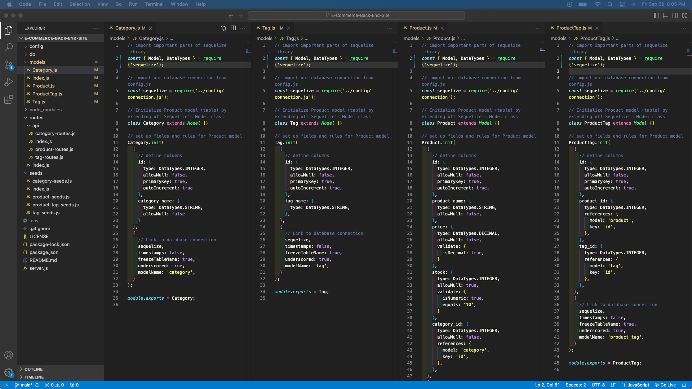
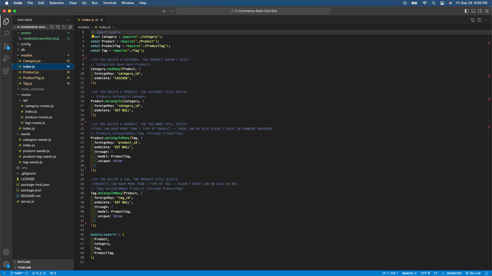
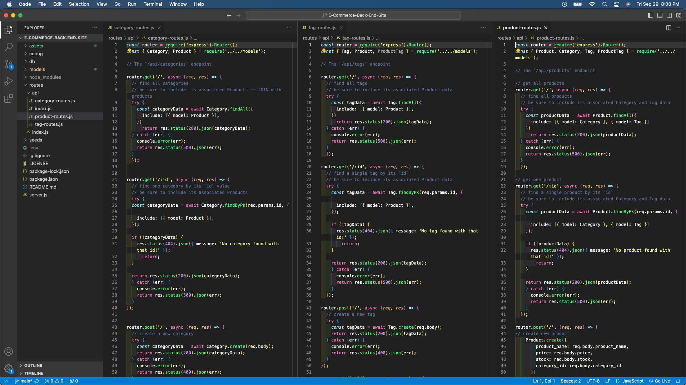
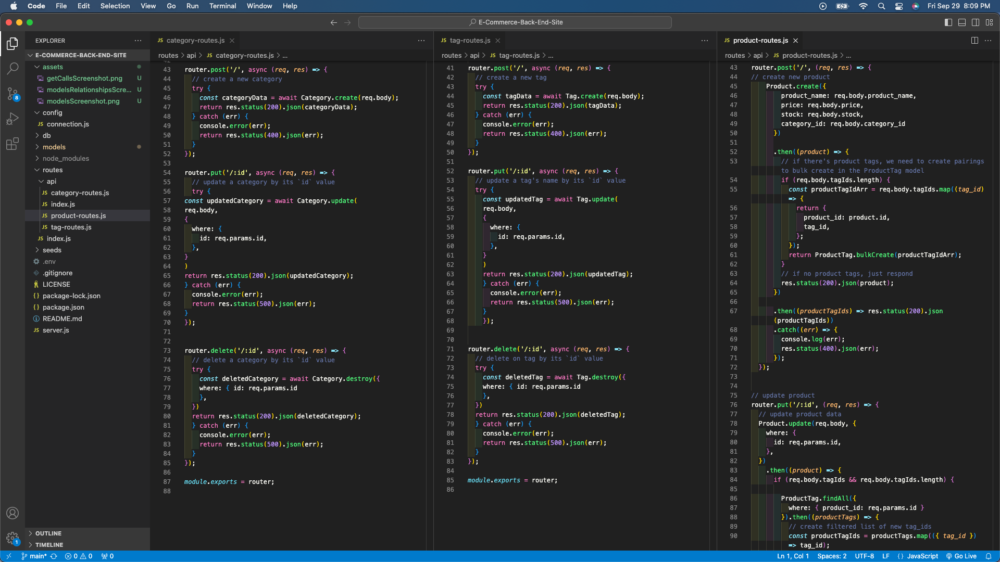

# E-Commerce Back End Site

## Table of Contents
- [Description](#description)
- [Installation](#installation)
- [Usage](#usage)
- [License](#license)
- [Contribution](#contribution)
- [Tests](#tests)
- [Questions](#questions)

## Description
The purpose of this project is to build the back end for an e-commerce website.

## Installation
Clone the starter code here for the front end coding of the application: https://github.com/coding-boot-camp/fantastic-umbrella. VS Code to code the back end of the application. GibHub for version control. Install mysql (https://www.w3schools.com/mysql/mysql_install_windows.asp). Run npm install in the terminal after cloning the starter code to access these packages for the application: MySQL2 (https://www.npmjs.com/package/mysql2) Sequelize and (https://www.npmjs.com/package/sequelize), to connect the Express.js API to a MySQL database. The dotenv package will also be accessible in the package.json, which allows the use of environment variables to store sensitive data, specifically the MySQL username, password, and database name. Download Insomnia to test the GET, POST, PUT, and DELETE calls in the VS code: https://insomnia.rest/download.

## Usage
This can be used when users need to create the back end for an e-commerce website.

View a screenshot of the models in VS Code:

View a screenshot of the model relations in VS Code:

View a screenshot of the GET calls in VS Code:

View a screenshot of the POST, PUT, DELETE calls in VS Code:

## License
This project is under the MIT license.

## Contribution
The starter code contains the initial setup of the back end: https://github.com/coding-boot-camp/fantastic-umbrella. The assignment also gave instructions for setting up the database models. The coding in the server.js file (imports, boilerplate middleware, port listener), the coding in the models files (set up its fields and rules), the coding in the index file (establishing the relations between models), and the coding in the routes files (GET, POST, PUT, DELETE calls) -all the additions- are credited to the curriculum taught in the UCI coding boot camp by the instructor.

To complete the README with screenshots, the source for the code is: https://stackoverflow.com/questions/10189356/how-to-add-screenshot-to-readmes-in-github-repository.
To complete the README section, the source is: https://coding-boot-camp.github.io/full-stack/github/professional-readme-guide.
To complete the markdown for the README, the source is: https://www.markdownguide.org/basic-syntax/
https://gist.github.com/lukas-h/2a5d00690736b4c3a7ba.

## Tests
To test the functionality of the E-Commerce back end site, users can clone this repo, run npm install, and follow the video for steps on creating the schema from the MySQL shell (open the terminal and log into mysql, run ‘SOURCE.schema.sql;’ in the command line, run ‘USE ecommerce.db;’ in the command line), seeding the database from the command line (run “npm run seed”), and starting the application’s server (run “node server” in the command line). View the video for the step-by-step set-up: https://drive.google.com/file/d/1Nz_98z5w_EcO9Bdpk5ExNWuhROi4sqbs/view?usp=sharing.

Open insomnia and make calls with the base domain http://localhost:3001, with the parameters depending on what the call calls for in the routes>api>routes files. Use the videos for reference:
Perform GET calls with Insomnia: https://drive.google.com/file/d/1xkNwqg6SAwPyrrilpn5G0E3pf7WzjRYC/view?usp=sharing and 
https://drive.google.com/file/d/1ZjFXKaTQbOt5vrTpXyh9VsKaUacCnrgG/view?usp=sharing. Perform POST, PUT, DELETE calls with Insomnia: https://drive.google.com/file/d/1lFTNONqB5XU6gHOZy6qWUXrvwFPf9syH/view?usp=sharing.

## Questions
The link to my Github Profile here: https://github.com/codeandlift706.
For any additional questions, please reach me at: channguyen715@gmail.com.
